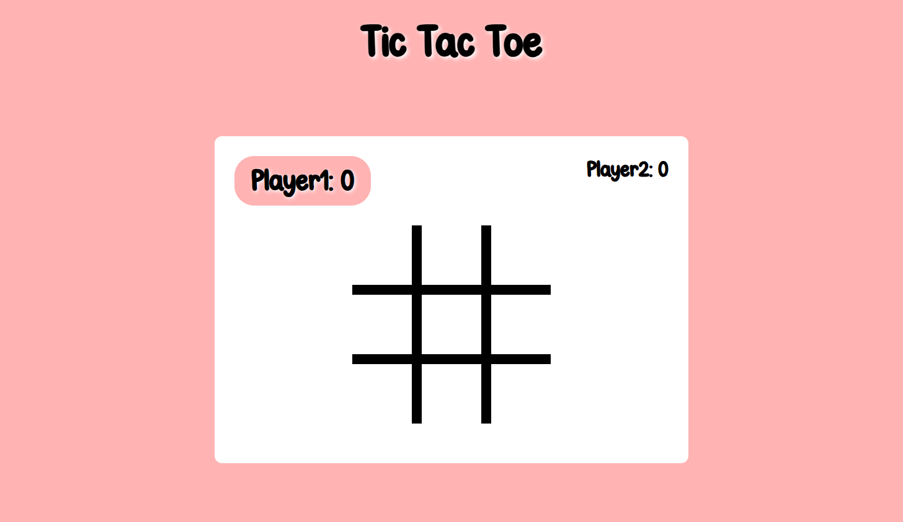

# Tic Tac Toe

A browser-based Tic Tac Toe game built as part of [The Odin Project](https://www.theodinproject.com/) JavaScript curriculum.

## Screenshot



<!-- Replace screenshot.png with the name/path of your screenshot -->

## Live Demo

[View the live demo](https://sitradaru.github.io/tic-tac-toe/)

<!-- Replace # with your GitHub Pages / live deployment URL -->

## About

A two-player Tic Tac Toe game where players can enter their names, take turns placing their marks, keep track of their scores, and restart the board for a new round.

The project was built with a focus on keeping the game logic separate from the DOM and practicing JavaScript factory functions, closures, and the module pattern.

## Features

* Two-player gameplay
* Visual indication of the active player
* Win and tie detection
* Prevents moves on occupied cells
* Score tracking across rounds
* Restart button for starting a new round
* Responsive layout

## Built With

* HTML5
* CSS3
* JavaScript
* Git / GitHub

## What I Practiced

* Factory functions
* Closures and private state
* IIFE / module pattern
* Separation of game logic and DOM logic
* Array methods such as `map()`, `every()`, and `some()`
* Managing game state
* DOM manipulation
* Custom fonts with `@font-face`
* CSS Grid and Flexbox

## Project Structure

```text
tic-tac-toe/
├── fonts/
│   ├── ChillinonSunday.woff
│   └── ChillinonSunday.woff2
├── index.html
├── script.js
├── style.css
└── screenshot.png
```

## How to Run Locally

1. Clone the repository:

```bash
git clone git@github.com:sitradaru/tic-tac-toe.git
```

2. Navigate into the project directory:

```bash
cd tic-tac-toe
```

3. Open `index.html` in your browser.

No additional dependencies or installation steps are required.

## Acknowledgements

* [The Odin Project](https://www.theodinproject.com/) — project requirements and JavaScript curriculum
* [Chillin on Sunday](https://www.dafont.com/chillin-on-sunday.font) — font used in the project

## Author

**Sitra Daru**

* GitHub: [sitradaru](https://github.com/sitradaru)
